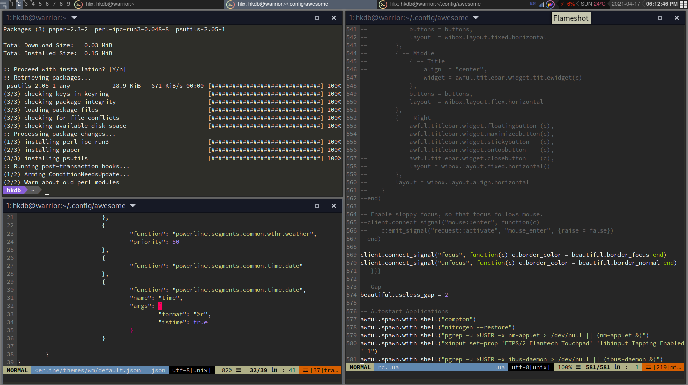

# My Awesome WM Config
maintianed by: @hkdb

## SUMMARY

Starter configurations for Awesome WM customized to my liking for Arch(-based) Linux.

## DEFAULTS

- Terminal: Tilix
- Browser: Brave
- Editor: vim w/ customization
- Screenshot: Shutter
- Layout: Fair
- Powerline: Weather, Date, Time
- Widgets: Battery, Volume, CPU, RAM
- Network: Network Manager Applet, Blueman
- Input: ibus-damon, ibus-rime (pinyin) 
- Auto Start: AeroFS, OverGrive, Nextcloud
- Wallpaper: *nixtr
- Shortcut: Media keys for volume control
- Compositor: Compton

## INSTALL

1. `git clone https://github.com/hkdb/awesome-config.git`
2. `cd awesome-config`
3. `./install.sh`
4. Logout and login to awesome

## CHANGE LOG

- 07132021 - Added more customization & refined install
- 04172021 - Initial commit

## SUPPORT US!

If this repo was useful to you, feel free to buy us some coffees! :)

## DISCLAIMER

This repo is maintained by volunteers and in no way do the maintainers make any guarantees. Please use at your own risk!

To Learn more, please visit:

https://osi.3df.io

https://3df.io

