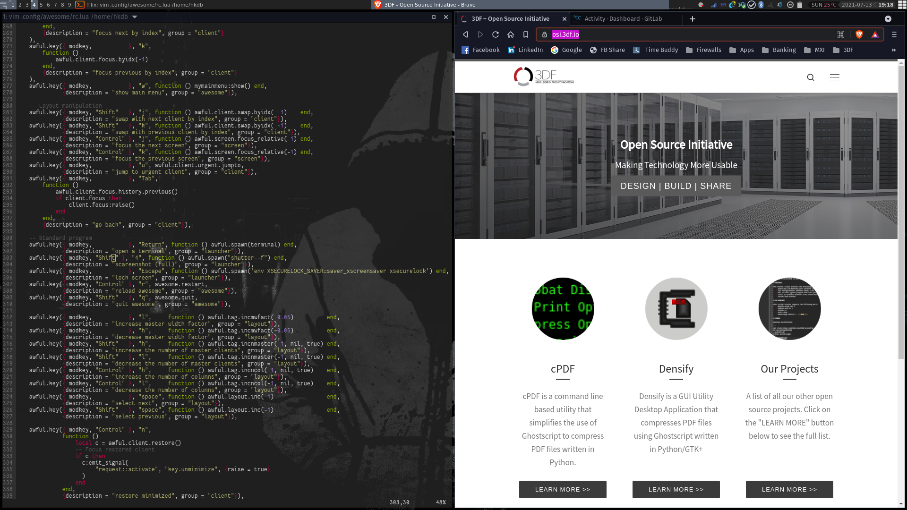

# My Awesome WM Config
maintianed by: @hkdb

## SUMMARY

Starter configurations for Awesome WM customized to my liking tested against Arch Linux.

## DEFAULTS

- Terminal: Tilix
- Browser: Brave
- Editor: vim

## PRE-REQUISITES

- [hkdb/sysconfig](https://github.com/hkdb/sysconfig)

## INSTALL

1. `git clone https://github.com/hkdb/awesome-config.git`
2. `cd awesome-config`
3. `./install.sh`
4. Logout and login to awesome

## CHANGE LOG

- 04172021 - Initial commit

## DISCLAIMER

This repo is maintained by volunteers and in no way do the maintainers make any guarantees. Please use at your own risk!

To Learn more, please visit:

https://osi.3df.io

https://3df.io

